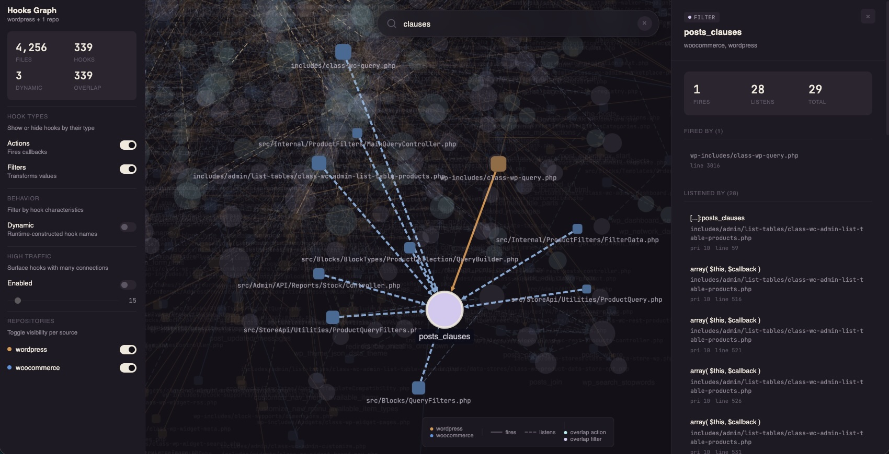

# WordPress Hooks Graph

> Static analysis for WordPress hook dependencies — point it at plugins, themes, or core and get an interactive dependency graph.

Parses every `do_action`, `add_action`, `apply_filters`, and `add_filter` call using PHP's built-in `token_get_all()` tokenizer. No WordPress runtime, no database, no autoloading — just source files in, dependency graph out.



## Requirements

- **PHP** 7.4+ &nbsp;·&nbsp; **Node** 18+

## Quick Start

```sh
npm install
npm run setup                    # one-time: installs the `hooksgraph` shell alias
source ~/.zshrc                  # pick up the alias in this shell
npm run build                    # build the React viewer
hooksgraph /path/to/wordpress    # parse + serve + open
```

`hooksgraph <dir>` parses the given directory (or directories), starts a local PHP server on port 8080 (falls back to the next free port), and opens the viewer in your browser.

*Don't want a global alias? Call `bin/hooksgraph /path/to/wordpress` directly.*

### Iterate faster

Parse once, re-serve the same JSON without re-parsing:

```sh
npm run parse -- /path/to/wordpress -o storage/wp.json
npm run serve -- storage/wp.json   # omit the path to use the latest file in storage/
```

*Common pitfall: the `--` is required so npm forwards arguments to the parser instead of consuming them itself.*

---

## Commands

### Setup

| Command | Description |
|---|---|
| `npm install` | Install Node dependencies |
| `npm run setup` | Install the `hooksgraph` shell alias (run `source ~/.zshrc` after) |
| `npm run build` | Build the React viewer into `dist/` |

### Run

| Command | Description |
|---|---|
| `hooksgraph <dirs...>` *(or `bin/hooksgraph`)* | Parse + serve + open browser in one step |
| `npm run parse -- <dirs...>` | Parse PHP files; output path printed at the end |
| `npm run parse:help` | Show full parser help (all flags + examples) |
| `npm run serve -- [json]` | Serve the built viewer with a JSON (defaults to latest in `storage/`) |
| `npm run dev -- --json <path>` | Vite dev server with hot reload, bound to a specific JSON |

### Test

| Command | Description |
|---|---|
| `npm test` | Run PHP + JS test suites |
| `npm run test:php` / `test:js` / `test:watch` | PHP only / Vitest / Vitest watch mode |

---

## Parse Options

Everything after `--` is forwarded to the parser:

```sh
# Single directory
npm run parse -- ~/Code/wordpress

# Multiple directories (useful with --overlap-only)
npm run parse -- ~/Code/wordpress ~/Code/my-plugin --overlap-only

# Exclude folders by name (in addition to .gitignore)
npm run parse -- ~/Code/wordpress --exclude vendor,tests,node_modules

# Custom output file
npm run parse -- ~/Code/wordpress -o storage/wp-core.json
```

---

## Viewer

Run `hooksgraph <dir>` — or `npm run dev -- --json storage/wp.json` after parsing separately — to open the viewer.

**Features:** search, layout switching (dagre / force / concentric), source filtering, hotspot highlighting, and a detail panel on node click.

The **Sources** card in the sidebar holds per-repo fire/listen toggles, plus two opt-ins for raw fire-only and listen-only hooks (hooks the scan found on just one side of the edge).

---

## MCP Server

`bin/hooks-mcp.js` is a local MCP stdio server that exposes every parsed codebase in `storage/` as structured, paginated tools — so any agent on the machine can query your graphs without slurping JSON into context.

### Register with Claude Code

User scope (available in every project):

```sh
claude mcp add hooks-graph --scope user -- \
  node /absolute/path/to/wp-hooks-graph/bin/hooks-mcp.js \
  --storage /absolute/path/to/wp-hooks-graph/storage
```

`--scope user` registers the server in your user-level Claude config so it's available across every repo you open — handy when you want to query `wordpress` or `woocommerce` graphs from a plugin directory. Drop `--scope user` to register at the default local (per-project) scope instead.

*Common pitfall: the `--` before `node` is required. Without it, `claude mcp add` swallows `--storage` as its own option and the server registers with an empty command.*

Verify with `claude mcp list` (should show `hooks-graph: ✓ Connected`) and `claude mcp get hooks-graph`. Remove with `claude mcp remove hooks-graph -s user`.

Or run directly for testing: `npm run mcp -- --storage storage`. Storage also falls back to `$HOOKSGRAPH_STORAGE` and then `./storage` relative to cwd.

### Tools

| Tool | Purpose |
|---|---|
| `list_codebases` | Enumerate available codebases with their scan metadata |
| `find_hook(name, codebase?)` | Exact-name hook lookup, single codebase or across all |
| `listeners_of(hook, codebase, limit?, offset?)` | Every `add_action` / `add_filter` for a hook |
| `firers_of(hook, codebase, limit?, offset?)` | Every `do_action` / `apply_filters` call site |
| `hooks_in_file(file_path, codebase, limit?, offset?)` | All hook activity in a specific file |
| `search_callbacks(substring, codebase?, limit?, offset?)` | Case-insensitive substring search over listener callbacks, optionally cross-codebase |
| `hotspots(codebase, metric?, limit?)` | Top hooks by `total`, `fires`, or `listens` |

Re-parse a codebase (`npm run parse -- ...`) and the next MCP call picks up the new data automatically — mtime-based invalidation, no daemon, no restart.

**What to ask it:**

- *"Which callbacks in `woocommerce-bookings` listen on `woocommerce_before_single_product`?"*
- *"Across every codebase, anything with `gateway_stripe_webhook` in the callback name?"*

---

## Limitations

This is a **static parser**, not a runtime tracer. A few things to keep in mind:

- **Dynamic hook names** — Hooks built from variables (e.g. `do_action( "save_post_{$post->post_type}" )`) can't be fully resolved at parse time. The parser extracts what it can and marks the rest with a `*` wildcard (`save_post_*`). Fully dynamic names (bare variables) are flagged but unresolvable.
- **Conditional registration** — The parser sees every `add_action` / `add_filter` call in the source, whether or not the surrounding `if` block would execute at runtime. The graph shows what *could* run, not what *will* run.
- **Callbacks only, not call chains** — The graph connects hooks to their direct callbacks. It won't trace what happens *inside* a callback (if a callback fires another hook, that's a separate edge — not a linked chain).
- **No autoloading or `include` resolution** — Files are parsed independently. If a hook name or callback is defined in an included file, the parser won't cross-reference it — just scan both directories.

---

## Project Structure

```
hooks_graph.php       PHP CLI parser + graph builder
server.php            Router for `php -S`
bin/hooksgraph        Parse + serve + open-browser wrapper
bin/serve             Serve a JSON with the built viewer (used by hooksgraph)
bin/hooks-mcp.js      MCP stdio server over the storage/ JSONs
bin/setup_profile.sh  Installs the `hooksgraph` shell alias
src/                  React viewer (Vite + Cytoscape); filter pipeline + its Vitest suite live here
src/mcp/              MCP server implementation (registry, per-codebase indexes, tool handlers)
storage/              Generated JSON output (git-ignored)
```
