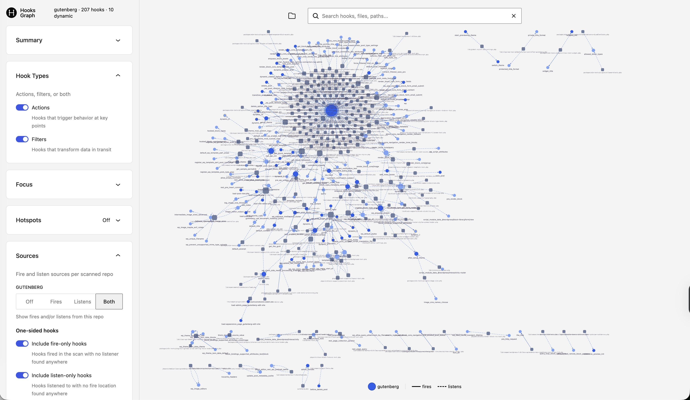
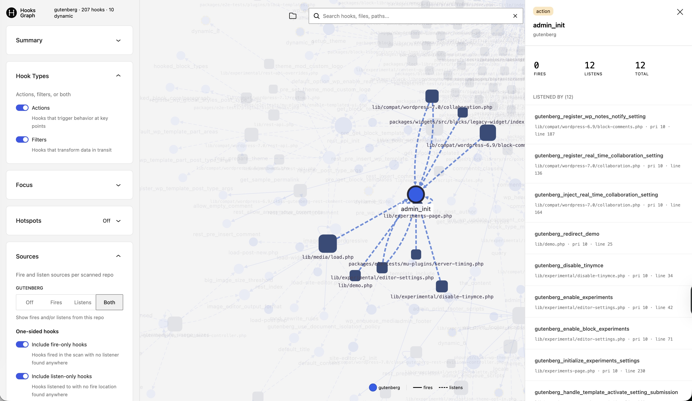

# WordPress Hooks Graph

> Static analysis for WordPress hook dependencies — point it at plugins, themes, or core and get an interactive dependency graph.

Parses every `do_action`, `add_action`, `apply_filters`, and `add_filter` call using PHP's built-in `token_get_all()` tokenizer. No WordPress runtime, no database, no autoloading — just source files in, dependency graph out.





## Requirements

- **PHP** 8.2+ &nbsp;·&nbsp; **Node** 18+ &nbsp;·&nbsp; **pnpm** 10+

## Quick Start

```sh
pnpm install
pnpm setup:alias                 # one-time: installs the `hooksgraph` shell alias
                                 # (tells you which RC file to `source` afterwards)
hooksgraph /path/to/wordpress    # parse + serve + open
```

`hooksgraph <dir>` parses the given directory (or directories), builds the viewer on first run, starts a local PHP server on port 8080 (falls back to the next free port), and opens the viewer in your default browser.

Setup supports zsh, bash, and fish — it picks the right RC file based on `$SHELL` and prints the exact `source` command to re-run. *Don't want a global alias? Call `packages/cli/bin/hooksgraph.js /path/to/wordpress` directly — no setup step needed.*

### AI-assisted setup (Claude Code)

Working in Claude Code? This repo ships an onboarding skill at [`.ai/skills/hooksgraph-setup/`](.ai/skills/hooksgraph-setup/SKILL.md). Open the repo and say something like *"set up wp-hooks-graph"* — the skill runs `pnpm install`, wires the shell alias, and registers the [`hooks-graph` MCP server](#mcp-server) in one pass, asking for confirmation before touching your shell RC. Reruns are idempotent, so it's also the fastest way to repair a partial setup.

### Iterate faster

Parse once, re-serve the same JSON without re-parsing:

```sh
hooksgraph parse /path/to/wordpress -o storage/wp.json
hooksgraph serve storage/wp.json   # omit the path to use the latest file in storage/
```

Run `hooksgraph --help` for the top-level command list, or `hooksgraph parse --help` / `hooksgraph serve --help` for per-subcommand flags.

---

## Commands

### Setup

| Command | Description |
|---|---|
| `pnpm install` | Install Node dependencies across the workspace |
| `pnpm setup:alias` | Install the `hooksgraph` shell alias (zsh / bash / fish — the script picks the right RC file) |
| `pnpm build` | One-shot: `composer install` + CLI assembly (viewer build + parser composer no-dev + copy into `packages/cli/`) |
| `pnpm build:viewer` | Viewer-only rebuild into `packages/viewer/dist/` |

### Run

| Command | Description |
|---|---|
| `hooksgraph <dirs...>` *(or `packages/cli/bin/hooksgraph.js`)* | Parse + serve + open browser in one step |
| `hooksgraph parse <dirs...>` | Parse PHP files; output path printed at the end |
| `hooksgraph parse --help` | Show full parser help (all flags + examples) |
| `hooksgraph serve [json]` | Serve the built viewer with a JSON (defaults to latest in `storage/`) |
| `hooksgraph --help` | Top-level command list |
| `HOOKSGRAPH_JSON=<path> pnpm dev` | Vite dev server with hot reload, bound to a specific JSON |

### Test

| Command | Description |
|---|---|
| `pnpm test` | Run PHP + JS test suites |
| `pnpm test:php` / `test:js` / `test:watch` | PHP only / Vitest / Vitest watch mode |

---

## Parse Options

```sh
# Single directory
hooksgraph parse ~/Code/wordpress

# Multiple directories (useful with --overlap-only)
hooksgraph parse ~/Code/wordpress ~/Code/my-plugin --overlap-only

# Exclude folders by name (in addition to .gitignore)
hooksgraph parse ~/Code/wordpress --exclude vendor,tests,node_modules

# Custom output file
hooksgraph parse ~/Code/wordpress -o storage/wp-core.json
```

---

## Viewer

Run `hooksgraph <dir>` — or `hooksgraph serve` / `HOOKSGRAPH_JSON=storage/wp.json pnpm dev` after parsing separately — to open the viewer.

**Features:** search, layout switching (dagre / force / concentric), source filtering, hotspot highlighting, and a detail panel on node click.

The **Sources** card in the sidebar holds per-repo fire/listen toggles, plus two opt-ins for raw fire-only and listen-only hooks (hooks the scan found on just one side of the edge).

---

## MCP Server

`packages/mcp/bin/hooksgraph-mcp.js` is a local MCP stdio server that exposes every parsed codebase in `storage/` as structured, paginated tools — so any agent on the machine can query your graphs without slurping JSON into context.

### Register with Claude Code

The [`hooksgraph-setup` skill](#ai-assisted-setup-claude-code) handles this for you. To do it manually at user scope (available in every project):

```sh
claude mcp add hooks-graph --scope user -- \
  node /absolute/path/to/wp-hooks-graph/packages/mcp/bin/hooksgraph-mcp.js \
  --storage /absolute/path/to/wp-hooks-graph/storage
```

`--scope user` registers the server in your user-level Claude config so it's available across every repo you open — handy when you want to query `wordpress` or `woocommerce` graphs from a plugin directory. Drop `--scope user` to register at the default local (per-project) scope instead.

Verify with `claude mcp list` (should show `hooks-graph: ✓ Connected`) and `claude mcp get hooks-graph`. Remove with `claude mcp remove hooks-graph -s user`.
Or run directly for testing: `pnpm mcp -- --storage storage`. Storage also falls back to `$HOOKSGRAPH_STORAGE` and then `./storage` relative to cwd.

### Tools

| Tool | Purpose |
|---|---|
| `list_codebases` | Enumerate available codebases with their scan metadata |
| `find_hook(name, codebase?)` | Exact-name hook lookup, single codebase or across all |
| `listeners_of(hook, codebase, limit?, offset?)` | Every `add_action` / `add_filter` for a hook |
| `firers_of(hook, codebase, limit?, offset?)` | Every `do_action` / `apply_filters` call site |
| `hooks_in_file(file_path, codebase, limit?, offset?)` | All hook activity in a specific file |
| `search_callbacks(substring, codebase?, limit?, offset?)` | Case-insensitive substring search over listener callbacks, optionally cross-codebase |
| `hotspots(codebase, metric?, limit?)` | Top hooks by `total`, `fires`, or `listens` |
| `shared_hooks(codebases?, substring?, min_sources?, sort?, limit?, offset?)` | Hooks that appear in ≥2 codebases, with per-codebase counts and `hook_type_divergence` flag |
| `compare_hook(hook? \| substring?, codebases?, limit?, offset?)` | Pivot one or more hooks across codebases; listeners sorted by priority ASC then codebase then file:line |

Re-parse a codebase (`hooksgraph parse ...`) and the next MCP call picks up the new data automatically — mtime-based invalidation, no daemon, no restart.

**What to ask it:**

- *"Which callbacks in `woocommerce-bookings` listen on `woocommerce_before_single_product`?"*
- *"Across every codebase, anything with `gateway_stripe_webhook` in the callback name?"*
- *"Which `woocommerce_cart_item_*` hooks do my extensions all touch?"* → one `shared_hooks(substring: "cart_item")` call
- *"Show me every listener on `woocommerce_add_to_cart_validation` across my Woo extensions, in priority order."* → one `compare_hook(hook: "woocommerce_add_to_cart_validation")` call

---

## Limitations

This is a **static parser**, not a runtime tracer. A few things to keep in mind:

- **Dynamic hook names** — Hooks built from variables (e.g. `do_action( "save_post_{$post->post_type}" )`) can't be fully resolved at parse time. The parser extracts what it can and marks the rest with a `*` wildcard (`save_post_*`). Fully dynamic names (bare variables) are flagged but unresolvable.
- **Conditional registration** — The parser sees every `add_action` / `add_filter` call in the source, whether or not the surrounding `if` block would execute at runtime. The graph shows what *could* run, not what *will* run.
- **Callbacks only, not call chains** — The graph connects hooks to their direct callbacks. It won't trace what happens *inside* a callback (if a callback fires another hook, that's a separate edge — not a linked chain).
- **No autoloading or `include` resolution** — Files are parsed independently. If a hook name or callback is defined in an included file, the parser won't cross-reference it — just scan both directories.

---

## Project Structure

The repo is a pnpm workspace. Each package under `packages/` ships on its own channel.

```
packages/
  parser/             PHP library — HooksGraph\ namespace, CLI parser + graph builder
    hooksgraph.php      Thin CLI entry (require vendor/autoload.php, run HooksGraph\Cli\Runner)
    server.php          Router for `php -S`
    src/                Parser, Graph, Discovery, Cli classes
    tests/              PHPUnit
  viewer/             Vite + React app (Cytoscape); bundled into the CLI tarball
  cli/                @hooksgraph/hooksgraph (npm) — Node shim wrapping the PHP parser + viewer
    bin/hooksgraph.js
  mcp/                @hooksgraph/hooksgraph-mcp (npm) — stdio MCP server
    bin/hooksgraph-mcp.js
    src/                server.js + tools (registry, per-codebase indexes, tool handlers)
    tests/              Vitest
  plugin/             WP.org plugin shell (scaffolded; real pipeline in a follow-up spec)

bin/
  serve               Finds a free port, launches `php -S` against packages/viewer/dist/
  setup-profile.sh    Installs the `hooksgraph` shell alias (aliases to the Node shim)

scripts/
  build-cli.js        Assembles packages/cli/ for publish (viewer build + parser composer no-dev)

storage/              Generated JSON output (git-ignored; .keep tracked)
```
